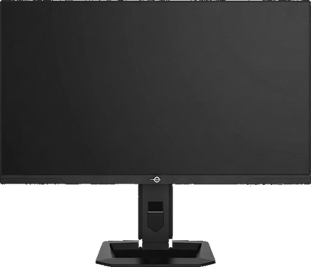

# Titan Control

A Linux app for the **Titan Army P275MV PLUS** monitor. It changes the monitor's own settings over DDC/CI, the
same settings as the on-screen menu (OSD): picture modes, local dimming, HDR, game overlays, PIP, LED lighting and
more. Nothing is emulated in software.

Built with Rust, GTK 4 and libadwaita. It is not affiliated with Titan Army.

> ## ⚠️ Use at your own risk
>
> This software writes settings to your monitor over DDC/CI. A wrong write can change or lock features or, in the
> worst case, leave the monitor in a state that needs a factory reset or service. **The authors give no warranty
> (see the [MIT license](LICENSE)) and are not responsible for any damage.**

> ## 🤖 Developed with an LLM
>
> This repository was developed with the help of a large language model (LLM, Claude). The code, documentation and
> the protocol notes in `docs/` were written and revised with LLM assistance and checked against a real monitor by
> the author, but **they may still contain mistakes. Review the code before you trust it with your hardware.**

<p align="center"></p>

## Features

- **Overview:** the monitor with your wallpaper on its screen, resolution, refresh rate and scaling of the output,
  aspect ratio.
- **Picture mode:** all 15 modes (Standard, RTS, FPS, MOBA, Movie, Reading, Night, Eye Care, MacView, E-book, sRGB,
  AdobeRGB, DCI-P3, DyDs/ULL FPS, DyDs/LD) in their Default or Custom variant, and everything saved in a profile, in
  the order of the OSD:
  - _Basic:_ brightness, contrast, DCR, Low Blue Light, sharpness, gamma.
  - _Effects:_ HDR, Color Enhance, CR Enhance, Shadow Balance, Super Resolution, Night Vision, Dynamic OD.
  - _Backlight:_ local dimming, Halo Control, DyDs.
  - _Color:_ color temperature with User RGB gains, hue and saturation per color axis.
  - The Custom settings are read from the monitor's profile table, the same way the manufacturer's tool reads them.
- **Gaming:** Adaptive-Sync, Full Game (Wide / 25"), and the overlays: refresh rate counter, crosshair, stopwatch,
  game timer, magnifier, HawkEye Vision, break reminder.
- **Inputs and audio:**
  - input source, RGB output range, USB hub upstream port, volume and mute;
  - PIP/PBP with source, audio source, position, size, swap and reset.
- **Lighting:** rear LED on/off, mode, color, strength, front/rear colors, power LED brightness.
- **Monitor:**
  - OSD language, timeout, position and transparency;
  - OSD lock, button lock, break reminder;
  - power saving, USB power in sleep, Quick Boot, power off;
  - resets, model and usage time.
- **Desktop integration:**
  - The resolution, refresh rate and scaling of the monitor's output can be changed (KDE Plasma and COSMIC on
    Wayland).
  - System HDR follows the monitor's HDR setting: turning HDR on in the app also turns it on in the system, and the
    other way round when it is turned off (KDE Plasma).
  - The overview shows the monitor with your wallpaper (KDE Plasma).
- **Tray menu:** up to 5 favorite picture modes (star next to the mode) and 5 favorite settings. Hold Ctrl (or the
  key chosen in Preferences) to show the stars next to the settings.
- **Stays in sync with the OSD:** changes made with the monitor's buttons appear in the app within a few seconds.
- English and Polish, light and dark theme, autostart (optionally minimized to the tray), narrow-window layout.

The protocol, every VCP code and the tools used to find them are documented in
[docs/p275mv_plus.md](docs/p275mv_plus.md).

## Requirements

- Linux with access to the monitor's I2C bus (`i2c-dev`).
- GTK ≥ 4.14, libadwaita ≥ 1.7, `blueprint-compiler`, Rust ≥ 1.88.
- Optional:
  - `kscreen-doctor` (KDE Plasma) or `cosmic-randr` (COSMIC) for the display mode, HDR and wallpaper features;
  - a tray that supports StatusNotifierItem (on GNOME: the AppIndicator extension).

Tested with a P275MV PLUS (Enhanced) connected over DisplayPort to an AMD GPU, on KDE Plasma 6 (Wayland).

## Installation

### Pre-built files

Every version is published on the [Releases](https://github.com/mkarenko/titan-control/releases) page:

| File | For |
| --- | --- |
| `titan-control_<version>_amd64.deb` | Debian 13+, Ubuntu 25.04+: `sudo apt install ./titan-control_*.deb` |
| `titan-control-<version>.x86_64.rpm` | Fedora 42+: `sudo dnf install ./titan-control-*.rpm` |
| `Titan_Control-<version>-x86_64.AppImage` | recent distributions (glibc 2.41+), GTK is bundled: `chmod +x`, then run |
| `titan-control-<version>-x86_64-linux.tar.gz` | any distribution, see below |

The deb and rpm install the I2C rules (`uaccess` udev rule and the `i2c-dev` module), so no group changes are needed.
The AppImage and the archive installed as a user need [I2C access](#2-i2c-access) set up by hand. Everything except
the AppImage needs GTK ≥ 4.14 and libadwaita ≥ 1.7 on your system (see [Requirements](#requirements)).

#### Release archive

```bash
tar -xzf titan-control-*-x86_64-linux.tar.gz
cd titan-control-*-x86_64-linux
./install.sh                     # to ~/.local (as root: /usr/local, with the I2C rules); --prefix DIR for another
```

Then set up [I2C access](#2-i2c-access) unless you ran the script as root, and start *Titan Control* from the menu.
`./uninstall.sh` removes it again (your settings stay in `~/.config/titan_control`). To build the archive yourself:
`./scripts/make_tarball.sh` (it ends up in `dist/`).

### Building from source

#### 1. Dependencies

```bash
# Arch Linux
sudo pacman -S gtk4 libadwaita blueprint-compiler rust

# Fedora
sudo dnf install gtk4-devel libadwaita-devel blueprint-compiler cargo

# Debian / Ubuntu (libadwaita 1.7: Debian 13, Ubuntu 25.04 or newer)
sudo apt install libgtk-4-dev libadwaita-1-dev blueprint-compiler cargo
```

#### 2. I2C access

```bash
sudo modprobe i2c-dev
echo i2c-dev | sudo tee /etc/modules-load.d/i2c-dev.conf   # load it on every boot
sudo groupadd -f i2c
sudo usermod -aG i2c "$USER"
```

Log out and back in. If `/dev/i2c-*` is not owned by the `i2c` group on your distribution, add a udev rule:

```bash
echo 'KERNEL=="i2c-[0-9]*", GROUP="i2c", MODE="0660"' | sudo tee /etc/udev/rules.d/45-i2c.rules
sudo udevadm control --reload && sudo udevadm trigger
```

#### 3. Build and install

```bash
git clone https://github.com/mkarenko/titan-control.git
cd titan-control
./scripts/install_local.sh
```

The script builds a release binary, installs it to `~/.local/bin/titan_control`, copies the assets to
`~/.local/share/titan_control/`, and adds the icon and a menu entry. To only build it: `cargo build --release`.

## Usage

Start **Titan Control** from the application menu (or run `titan_control`).

- The app finds the monitor, reads its settings and opens the window. Closing the window keeps it in the tray.
- The refresh button in the header reads everything from the monitor again: info, display mode, wallpaper and all
  settings.
- Settings that the monitor does not allow at the moment (see the [FAQ](FAQ.md)) are greyed out.
- _Monitor → Information → Installed firmware package_: choose the package your monitor runs; it changes what the
  app allows.
- Preferences (menu ⋮): language, theme, tray icon style, autostart, start minimized, favorites key.

## Reporting a problem

The app keeps a log of what it does, so a problem can be debugged. Open it with *menu ⋮ → Show the log file* or find it
at `~/.local/state/titan_control/titan_control.log` (`$XDG_STATE_HOME` is respected). The log holds the app, system,
GTK and libadwaita versions, the monitor connection, every setting the app writes with the result of its read-back,
and errors. It is cut at 1 MiB (the older part is kept as `titan_control.log.1`).

When you [open an issue](https://github.com/mkarenko/titan-control/issues/new), please attach the log, say which
monitor and firmware package you have, and what you did before the problem. The log contains the monitor name, but no
serial number or personal data; read it before you share it. For a problem seen while the app is running, starting it
from a terminal (`titan_control`) prints the same lines.

## More

- [FAQ](FAQ.md): supported monitors, missing features, greyed-out settings, firmware and update.
- [docs/p275mv_plus.md](docs/p275mv_plus.md): DDC/CI protocol and every VCP code.
- [firmware/](firmware/README.md): official firmware packages and the update procedure.

## Development

```bash
cargo run                        # the app (a running instance is activated instead of starting a second one)
cargo test                       # unit tests
TITAN_I2C=/dev/i2c-14 cargo test profile_table -- --ignored --nocapture   # hardware test: profile table reads
cargo clippy --all-targets
```

UI check without a monitor (does not touch the bus or a running instance):

```bash
TITAN_CHECK_UI=1 cargo run                                    # builds the window and exits
TITAN_CHECK_UI=1 TITAN_CHECK_UI_SHOTS=/tmp/shots cargo run    # saves a PNG of every page and of Preferences
TITAN_CHECK_UI_WIDTH=600 TITAN_CHECK_UI_HEIGHT=2000 …         # window size (narrow layout, tall pages)
TITAN_CHECK_LANG=en …                                         # language of the check (en or pl)
TITAN_CHECK_STARS=1 …                                         # show the favorite stars
```

## Support

Titan Control is free. If it is useful to you, you can [buy me a coffee ☕](https://buymeacoffee.com/mkarenko).

## Releasing

Set the new `version` in `Cargo.toml`, commit, then push a tag with the same number:

```bash
git tag v1.2.3 && git push origin v1.2.3
```

The [Release workflow](.github/workflows/release.yml) builds the tar.gz, deb, rpm and AppImage and publishes them,
with checksums, as a GitHub release (a tag with a suffix, such as `v1.2.3-beta.1`, becomes a pre-release). The tag
must match the version in `Cargo.toml`, or the workflow stops. The workflow can also be started by hand from the
*Actions* tab: it then only builds the files and keeps them as downloadable artifacts.

## License

[MIT](LICENSE).
